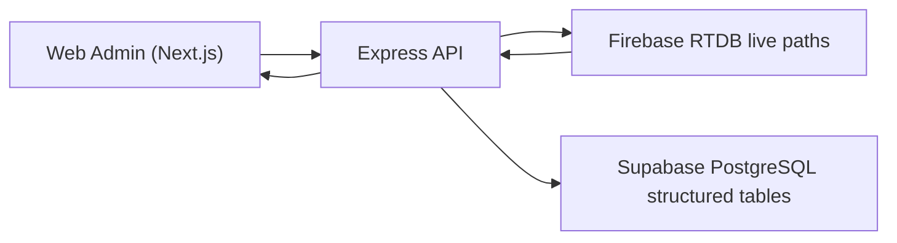

# POS Bus Admin Architecture

The Web Admin now uses a hybrid data model:

- Firebase Realtime Database is the live NoSQL source for POS device status, live bus movement, assistance requests, messages, expenses, legacy fare matrix data, and editable `AdminRoutes`.
- Supabase PostgreSQL is the structured SQL store for employees, buses, routes, route stops, route waypoints, tickets, payments, expenses, notifications, critical alerts, and sync logs.
- The Node.js API is the secure bridge. Admin-sensitive frontend requests go through Express before touching Firebase or Supabase.
- The Next.js admin frontend renders the command center UI and calls the backend API.

## Data Flow

## Runtime Folders

- `frontend/` contains the Next.js command center.
- `backend/` contains Express routes, Firebase Admin/RTDB REST access, Supabase access, sync services, validation, and middleware.
- `packages/shared/` contains shared TypeScript types, constants, and validators.
- `legacy/web-admin/` is retained only as reference for old Firebase behavior.

## Important Rule

`Routes_Forward` and `Routes_Reverse` are legacy fare matrix/reference paths only. Production Live Map and Route Config use `AdminRoutes` and/or Supabase `route_waypoints` for route lines.
