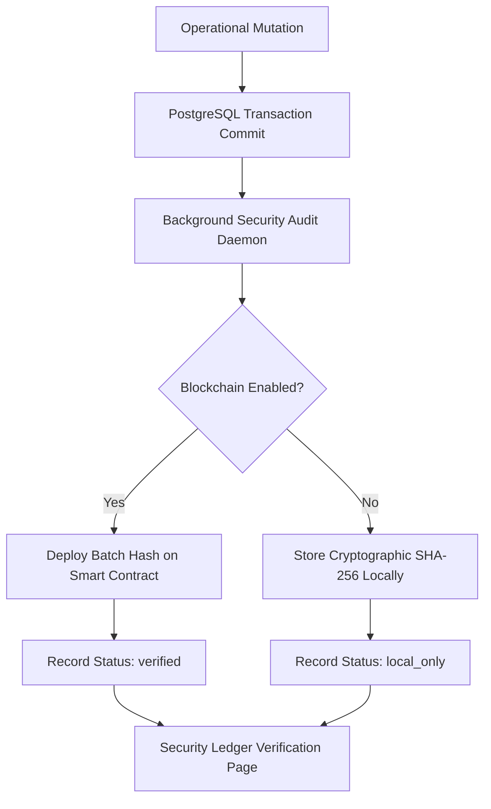

# Cryptographic Blockchain Audit Ledger Guide

Drive&Go incorporates blockchain-based verification audit capabilities to prove operational records (ticketing transactions, Daily Cash Remittances, Employee Violations) are tamper-proof.

---

## 1. How It Works (Architectural Flow)

The cryptographic security flow is decoupled from primary transactional paths to guarantee zero disruption, even if the blockchain nodes are offline.



---

## 2. Deterministic JSON Sorting

To prevent discrepancies caused by key order during JSON stringification (e.g. differences in compiler configurations or field sequence), payload objects are dynamically sorted alphabetically before hashing:

```typescript
function getStableJson(obj: any): string {
  if (obj === null || typeof obj !== "object") return JSON.stringify(obj);
  if (Array.isArray(obj)) return "[" + obj.map(getStableJson).join(",") + "]";
  
  const sortedKeys = Object.keys(obj).sort();
  const sortedObj: any = {};
  for (const key of sortedKeys) {
    sortedObj[key] = obj[key];
  }
  return JSON.stringify(sortedObj);
}
```

---

## 3. High-Speed Local Hashing vs. On-Chain Anchoring

### Local SHA-256 (Default Mode)
- **Environment**: `BLOCKCHAIN_ENABLED=false` (Default value).
- **Behavior**: The backend generates deterministic hashes of daily tickets, cash records, and incidents. These digests are stored in `blockchain_audit_ledger` marked as `local_only`.
- **Performance**: Instantaneous (< 1ms). Zero gas fees or RPC network calls required.
- **Fail-safe**: The ticketing system and POS apps operate perfectly without a blockchain network, preserving fast ticketing pipelines.

### On-Chain Anchoring (Active Mode)
- **Environment**: `BLOCKCHAIN_ENABLED=true`.
- **Behavior**: The backend aggregates the hashes and posts them to the `DriveAndGoLedger` smart contract deployed on your blockchain network.
- **Record Status**: Switched to `verified`.
- **Network Default**: A local **Hardhat** development node. Optional deployment parameters can target Sepolia or Polygon Amoy.

---

## 4. Smart Contract Architecture

The ledger is backed by a Solidity contract containing a mapping of record IDs to cryptographic hashes and anchor blocks:

- **Source Code**: `blockchain/contracts/DriveAndGoLedger.sol`
- **Functions**:
  - `anchorHash(string memory recordId, string memory recordHash)`: Registers a new tamper-proof hash.
  - `verifyHash(string memory recordId, string memory recordHash)`: Returns `true` if the record matches exactly, and provides the block timestamp of anchor deployment.

---

## 5. Deployment Guide (Hardhat Local Node)

To deploy the smart contract onto a local Hardhat node for development testing:

1. **Start Local Node**:
   ```bash
   cd blockchain
   npx hardhat node
   ```
2. **Deploy the Smart Contract**:
   In a separate terminal:
   ```bash
   cd blockchain
   npx hardhat run scripts/deploy.js --network localhost
   ```
3. **Configure the Environment**:
   Copy the deployed contract address and set these in your `backend/.env`:
   ```env
   BLOCKCHAIN_ENABLED=true
   BLOCKCHAIN_RPC_URL=http://127.0.0.1:8545
   BLOCKCHAIN_CONTRACT_ADDRESS=0x5FbDB2315678afecb367f032d93F642f64180aa3
   BLOCKCHAIN_PRIVATE_KEY=0xac0974bec39a17e36ba4a6b4d238ff944bacb478cbed5efcae784d7bf4f2ff80
   ```
